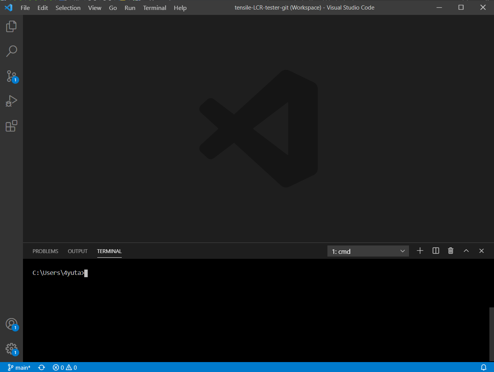

# Installation guide

This is a guide to support beginners who are new to python.

OS is only windows.

## Install Git

You need to install git because you need to install the library from GitHub.
[Git for windows](https://gitforwindows.org/)

## Install Python

If you don't have python, install it from the official website.

[Download Python | Python.org](https://www.python.org/downloads/)

You need to install version 3.9 or higher.
After installing the installer,  you install python following the guide.

## Install library

After the python installation is complete, you launch a command prompt to install the library.

If you are using an environment that has an integrated terminal(like VSCode, Pycharm etc...), you can also install from there.
Since I love VSCode, I will explain using VSCode below.

[Visual Studio Code | Microsoft](https://code.visualstudio.com/download)

Press `Ctrl + Shift + @` to start the integrated terminal.



You will use the launched terminal to install the library.

First, you will install self made library from github using the pip command.

```
pip install git+https://github.com/5yutan5/AutoLab git+https://github.com/5yutan5/DeviceController git+https://github.com/5yutan5/tensile-LCR-tester
```

Next, you install the dependent libraries from PyPI.

```
pip install pyqt5 psutil pyserial qtpy qdarkstyle
```

The installation is now complete.

## Get started

You type `tltester` in the terminal, and if you see window like the one below, you have succeeded.


