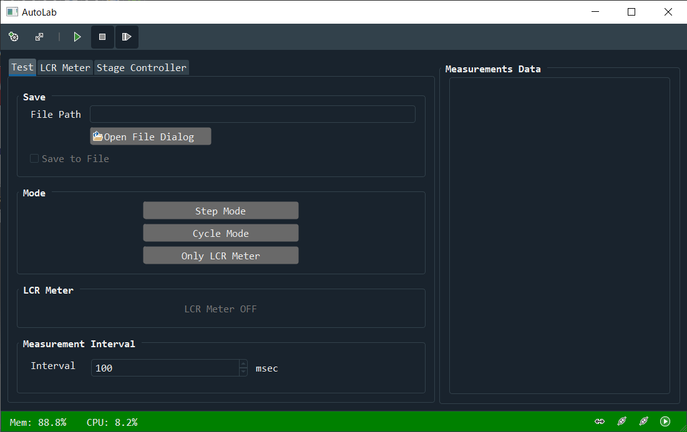
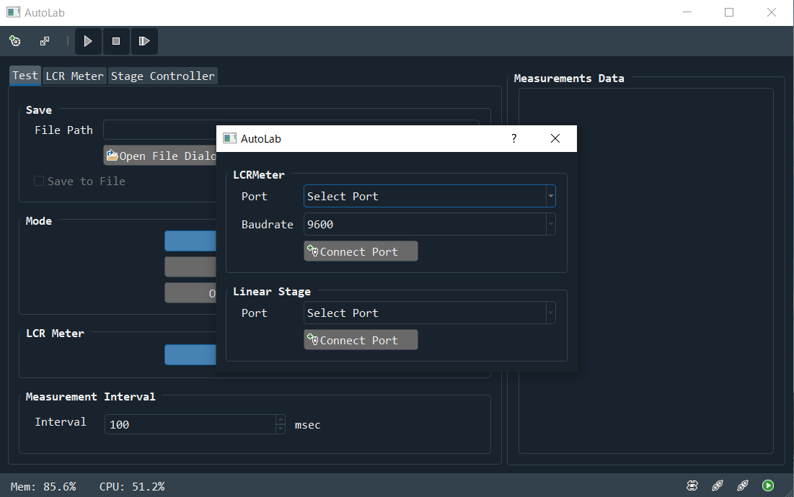

# tensile-LCR-tester
This application controls Hioki's LCR meter and Sigma Kouki's stage controller at the same time.

**This is an unfinished project.**



## Corresponding devices

The following devices are supported.

- [LCR METER IM3536 - Hioki](https://www.hioki.com/en/products/detail/?product_key=5824)
- [2 axis Stage Controller Shot702 - OptoSigma](https://www.global-optosigma.com/en_jp/Catalogs/gno/?from=page&pnoname=SHOT-702&ccode=W9045&dcode=&gnoname=SHOT-702)
- [Translation Motorized Stages SGSP26-200(Z) - OptoSigma](https://www.global-optosigma.com/en_jp/Catalogs/gno/?from=page&pnoname=SGSP26-%28Z%29&ccode=W9016&dcode=&gnoname=SGSP26-200%28Z%29)

It is necessary to install the driver for the device in advance.

[LCR METER IM3536 driver](https://www.hioki.com/en/support/versionup/detail/?downloadid=380)

[2 axis Stage Controller Shot702 driver](https://www.global-optosigma.com/en_jp/software/sample_en.html)

## Runtime dependencies

**Important Note**: Most all of the dependencies listed below will not be installed automatically. So you need to install them.

- Python 3.9+
- PyQt5 5.9+
- psutil 5.8+
- pyserial 3.5+
- qdarkstyle
- qtpy
- 5yutan5/AutoLab
- 5yutan5/DeviceController

## Installation

It can be installed with both pip and conda, but installing with conda is deprecated.

### Use conda

```
pip install git+https://github.com/5yutan5/AutoLab
pip install git+https://github.com/5yutan5/DeviceController
pip install git+https://github.com/5yutan5/tensile-LCR-tester
```
and
```
conda install pyqt psutil pyserial qtpy qdarkstyle
```

### Use pip

```
pip install git+https://github.com/5yutan5/AutoLab
pip install git+https://github.com/5yutan5/DeviceController
pip install git+https://github.com/5yutan5/tensile-LCR-tester
```
and
```
pip install pyqt5 psutil pyserial qtpy qdarkstyle
```

## Get started

The following command enter the terminal.

```
tltester
```

The application will launch and the device connection dialog will be displayed.


